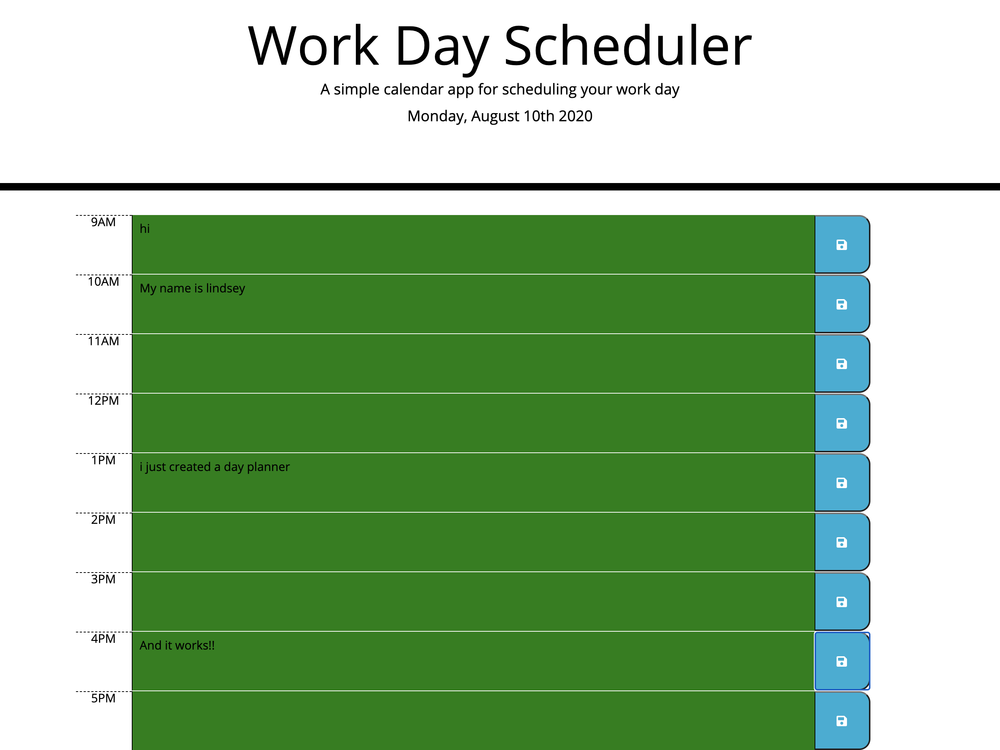

Homework Week 5 - Day Planner

Description:

This is a work day planner that changes availability to add to-do's by time of day. 

Date changes per day

Timeblocks change color depending on time of day. If the time of day is past, you can't enter any more text. 

Text is saved to local storage when the save button is clicked. Saved events persist when the page is refreshed.

Link to repo:

https://github.com/campbelllm/dayPlanner

Link to gitHub pages site:

https://campbelllm.github.io/dayPlanner/Develop/

Preview of site:

